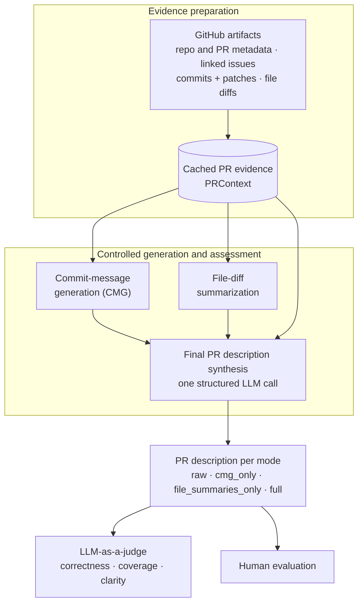

# Diff-Grounded PR Description Generation

An LLM pipeline that generates reviewer-ready GitHub pull-request descriptions directly from code evidence — commits, file diffs, and linked issues — under strict grounding rules.

This repository is the replication package for our research on automatic, diff-grounded pull request (PR) description generation. The core idea is **diff grounding**: every claim in a generated description must trace back to concrete evidence in the PR, so the model never invents motivation or behavior the diff does not support. The pipeline reconstructs a structured `PRContext` from GitHub artifacts, runs four controlled ablation modes, and evaluates the output with both an evidence-scoped LLM-as-a-judge and a human study.

## Table of Contents

- [Overview](#overview)
- [Installation](#installation)
- [Quick Start](#quick-start)
- [Reproduction Instructions](#reproduction-instructions)
- [Project Structure](#project-structure)

## Overview

The pipeline runs in two halves. The first **prepares evidence** from raw GitHub artifacts into a cached `PRContext`; the second performs **controlled generation and assessment** over that frozen evidence. Generation and judging stay inside the same evidence boundary, which is what enforces grounding.



The four generation modes toggle the two enhancement components (CMG and file-diff summarization), so each component's contribution can be isolated against the `raw` zero-shot baseline. The `PRContext` is implemented as a `networkx` knowledge graph and cached so every experiment sees an identical view of each PR. See [architecture.md](architecture.md) for a full, file-by-file reference.

## Installation

Estimated setup time: < 5 minutes.

**Prerequisites**

- Python 3.10+
- A GitHub token (for the artifact-collection stage)
- An LLM API key for the configured provider (default: OpenAI)

**Installation steps**

```bash
# 1. Set up a virtual environment
python3 -m venv .venv
source .venv/bin/activate

# 2. Install Python dependencies
pip install -r requirements.txt
```

Set the secrets you need as environment variables (or in a `.env` file at the repo root):

```bash
export GITHUB_TOKEN=...        # or GITHUB_CLASSIC_TOKEN
export OPENAI_API_KEY=...      # default provider
# optional alternates: MISTRAL_API_KEY / DEEPSEEK_API_KEY / GEMINI_API_KEY
# optional override:    LLM_PROVIDER=openai
```

Provider, model, datasets, ablation modes, ranking weights, and judge limits are all configured in `config/pipeline.yaml`.

## Quick Start

Run the three pipeline stages in order from the repo root:

```bash
# 1. Build the knowledge graph (cached PRContext) for the active dataset
python data-collection/build_knowledge_graph.py --limit 5

# 2. Generate PR descriptions across the active ablation modes
python description-generation/main.py --limit 10 --randomize

# 3. Judge generated vs. original descriptions
python judge/judge.py
```

To run a single PR:

```bash
python description-generation/main.py --repo_name owner/repo --pr 123
```

Outputs are written under `results/` (`knowledge_graph/`, `pr-description/<provider>/`, `judge/<provider>/`).

## Reproduction Instructions

To reproduce the paper's evaluation, run the full pipeline above on the configured dataset, then the analysis scripts:

```bash
cd final-results
python3 scripts/analyze_descriptions.py        # LLM-judge score summary
python3 scripts/analyze_failure_reasons.py     # failure taxonomy
python3 scripts/analyze_lexical_metrics.py     # BLEU / ROUGE
python3 scripts/analyze_human_evaluation.py    # human-study summary
python3 scripts/analyze_human_llm_agreement.py # human vs. LLM agreement
```

Across both datasets, the LLM judge prefers the generated description over the developer's original in **80–94%** of PRs, and a 10-reviewer human study agrees — generated descriptions win **80–83%** of pairwise comparisons against the original. Full tables and figures are in the paper.

Notes:
- `analyze_human_evaluation.py` runs against the included `final-results/data/human-data/`.
- The judge-derived analysis scripts read the judged-output JSONs your run produces (the large frozen evaluation set is not shipped with this artifact).

## Project Structure

- `config/` — pipeline configuration (`pipeline.yaml`) and loader
- `data/` — input dataset CSVs (`repo_name`, `pr_number`) and the PR-id normalizer
- `data-collection/` — GitHub artifact collection and the knowledge-graph builder/reader
- `description-generation/` — orchestrator, generation components (ranking, CMG, file-diff summarization), and provider wrappers
- `judge/` — evidence-scoped LLM-as-a-judge and survey export
- `final-results/scripts/` — analysis scripts that reproduce the evaluation tables and plots
- `final-results/data/human-data/` — blinded human-study survey and researcher key
- `architecture.md` — detailed technical reference for the full pipeline
- `requirements.txt` — Python dependencies
- `run_pipeline.sh` — convenience runner for the generation + judge stages
</content>
