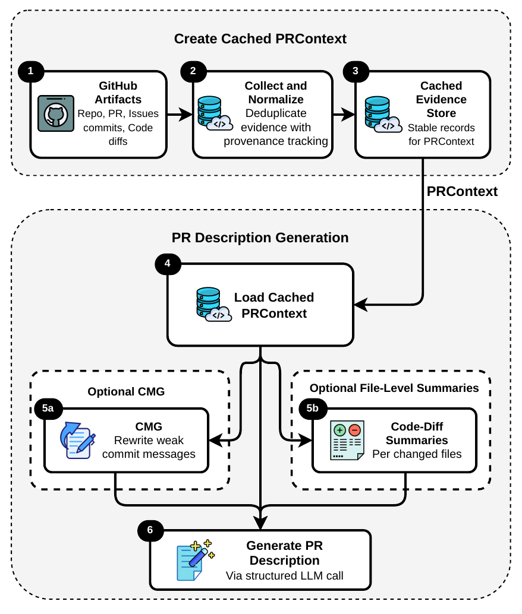

# Diff-Grounded Pull Request Description Generation

Replication package for **Diff-Grounded Pull Request Description Generation with Structured Evidence**, accepted at the 42nd IEEE International Conference on Software Maintenance and Evolution (ICSME 2026).

This repository contains the code, datasets, analysis scripts, human-study inputs, and paper figures for studying automatic, diff-grounded pull request (PR) description generation. The core idea is **diff grounding**: every claim in a generated description must trace back to concrete evidence in the PR, so the model does not invent motivation or behavior the diff does not support. The pipeline reconstructs a structured `PRContext` from GitHub artifacts, runs controlled ablation modes, and evaluates output with both an evidence-scoped LLM-as-a-judge and a human study.

## Table of Contents

- [Replication Package Information](#replication-package-information)
- [Overview](#overview)
- [Artifact Contents](#artifact-contents)
- [Canonical Paper Figures](#canonical-paper-figures)
- [Installation](#installation)
- [Quick Start](#quick-start)
- [Reproduction Instructions](#reproduction-instructions)
- [Generated Outputs](#generated-outputs)
- [Project Structure](#project-structure)
- [License](#license)

## Replication Package Information

| Item | Details |
| --- | --- |
| Paper | **Diff-Grounded Pull Request Description Generation with Structured Evidence** |
| Venue | 42nd IEEE International Conference on Software Maintenance and Evolution (ICSME 2026) |
| Artifact type | Replication package for code, datasets, analysis scripts, human-study inputs, and camera-ready figures |
| Primary workflow | Collect GitHub PR evidence, cache it as `PRContext`, generate ablation-mode PR descriptions, judge outputs, and regenerate final summaries |
| Main setup path | Create a Python virtual environment, install `requirements.txt`, set GitHub/LLM credentials, then run the three pipeline stages below |
| Canonical figures | Top-level PDFs under `figures/`; old versions are kept only under `figures/old-1/` and `figures/old-2/` |
| Included inputs | PR target CSVs under `data/` and human-study inputs under `final-results/data/human-data/` |
| Generated outputs | `results/`, `final-results/eval/`, and `final-results/data/description-data/` are regenerated locally and intentionally ignored by git |
| License | MIT License, with upstream terms retained for third-party/GitHub-derived material |

The fastest reviewer path is:

```bash
python3 -m venv .venv
source .venv/bin/activate
pip install -r requirements.txt

export GITHUB_TOKEN=...
export OPENAI_API_KEY=...

python data-collection/build_knowledge_graph.py --limit 5
python description-generation/main.py --limit 5
python judge/judge.py
```

## Overview

The pipeline runs in two halves. The first **prepares evidence** from raw GitHub artifacts into a cached `PRContext`; the second performs **controlled generation and assessment** over that frozen evidence. Generation and judging stay inside the same evidence boundary, which is what enforces grounding.

<table>
<tr>
<td width="38%" valign="top">
  
</td>
<td width="62%" valign="top">
The pipeline first creates a cached <code>PRContext</code> from GitHub artifacts, then reuses that frozen evidence for controlled generation and assessment. Optional commit-message generation and file-level summarization can be enabled independently, making each ablation mode comparable over the same PR evidence.

The README image is a compact preview derived from the canonical camera-ready PDF at <code>figures/architecture.pdf</code>. See <a href="architecture.md">architecture.md</a> for the full file-by-file technical reference.
</td>
</tr>
</table>

The four generation modes toggle the two enhancement components (CMG and file-diff summarization), so each component's contribution can be isolated against the `raw` zero-shot baseline. The `PRContext` is implemented as a `networkx` knowledge graph and cached so every experiment sees an identical view of each PR.

## Artifact Contents

This artifact is organized to support repeatability, inspection, and reuse:

- runnable source code for collection, generation, judging, and analysis
- input PR target lists under `data/`
- human-study inputs under `final-results/data/human-data/`
- analysis scripts under `final-results/scripts/`
- canonical camera-ready figure PDFs under `figures/`
- architecture and setup documentation

Generated outputs are intentionally excluded from version control and can be regenerated by running the pipeline. This keeps the public source package compact while preserving the commands needed to recreate the reported outputs.

## Canonical Paper Figures

The camera-ready paper figures are stored in [figures/](figures/). The top-level PDFs in that directory are the canonical versions:

| File | Purpose |
| --- | --- |
| `figures/architecture.pdf` | End-to-end system architecture. |
| `figures/architecture.png` | README preview derived from `figures/architecture.pdf`. |
| `figures/cached-artifact-schema.pdf` | Reconstructed `PRContext` record schema. |
| `figures/cmg.pdf` | Commit-message generation and quality-gating component. |
| `figures/file-diff-summarization.pdf` | File-diff selection and summarization component. |
| `figures/motivating-example.pdf` | Motivating example comparing original, raw zero-shot, and full diff-grounded descriptions. |

Earlier drafts are retained under `figures/old-1/` and `figures/old-2/` for provenance only; they are not the canonical paper figures.

## Installation

Estimated setup time: < 5 minutes, excluding API account setup and full pipeline runtime.

**Prerequisites**

- Python 3.10+
- A GitHub token (for the artifact-collection stage)
- An LLM API key for the configured provider (default: OpenAI)

**Container package**

A prebuilt GitHub Container Registry image is published from `main`:

```bash
docker pull ghcr.io/ise-research/diff-grounded-pr-gen:latest
docker run --rm -it \
  -e GITHUB_TOKEN \
  -e OPENAI_API_KEY \
  ghcr.io/ise-research/diff-grounded-pr-gen:latest
```

Inside the container, the repository is available at `/artifact`.

**Installation steps**

```bash
# 1. Set up a virtual environment
python3 -m venv .venv
source .venv/bin/activate

# 2. Install Python dependencies
pip install -r requirements.txt
```

Set the secrets you need as environment variables (or in a `.env` file at the repo root):

```bash
export GITHUB_TOKEN=...        # or GITHUB_CLASSIC_TOKEN
export OPENAI_API_KEY=...      # default provider
# optional alternates: MISTRAL_API_KEY / DEEPSEEK_API_KEY / GEMINI_API_KEY
# optional override:    LLM_PROVIDER=openai
```

Provider, model, datasets, ablation modes, ranking weights, and judge limits are all configured in `config/pipeline.yaml`.

**Smoke test**

After installation, run a small end-to-end sample:

```bash
# Build a small cached PRContext
python data-collection/build_knowledge_graph.py --limit 5

# Generate descriptions for a small sample
python description-generation/main.py --limit 5

# Judge generated vs. original descriptions
python judge/judge.py
```

Expected generated output locations:

- `results/knowledge_graph/`
- `results/pr-description/<provider>/`
- `results/judge/<provider>/`

## Quick Start

Run the three pipeline stages in order from the repo root:

```bash
# 1. Build the knowledge graph (cached PRContext) for the active dataset
python data-collection/build_knowledge_graph.py --limit 5

# 2. Generate PR descriptions across the active ablation modes
python description-generation/main.py --limit 10 --randomize

# 3. Judge generated vs. original descriptions
python judge/judge.py
```

To run a single PR:

```bash
python description-generation/main.py --repo_name owner/repo --pr 123
```

Outputs are written under `results/` (`knowledge_graph/`, `pr-description/<provider>/`, `judge/<provider>/`).

## Reproduction Instructions

To reproduce the paper's evaluation, run the full pipeline above on the configured dataset, then run the analysis scripts:

```bash
cd final-results
python3 scripts/analyze_descriptions.py        # LLM-judge score summary
python3 scripts/analyze_failure_reasons.py     # failure taxonomy
python3 scripts/analyze_lexical_metrics.py     # BLEU / ROUGE
python3 scripts/analyze_human_evaluation.py    # human-study summary
python3 scripts/analyze_human_llm_agreement.py # human vs. LLM agreement
```

Across both datasets, the LLM judge prefers the generated description over the developer's original in **80-94%** of PRs, and a 10-reviewer human study agrees: generated descriptions win **80-83%** of pairwise comparisons against the original. Full tables and figures are in the paper.

Notes:
- `analyze_human_evaluation.py` runs against the included `final-results/data/human-data/`.
- The judge-derived analysis scripts read the judged-output JSONs your run produces (the large frozen evaluation set is not shipped with this artifact).

## Generated Outputs

The following directories are generated at run time and intentionally excluded by `.gitignore`:

- `results/` - knowledge graphs, generated descriptions, judge outputs, and survey exports
- `final-results/eval/` - regenerated tables and plots
- `final-results/data/description-data/` - judged-output JSONs copied into the final analysis area

Local secrets and environments are also excluded:

- `.env`
- `.venv/`
- `pr-agent-env/`

## Project Structure

- `config/` - pipeline configuration (`pipeline.yaml`) and loader
- `data/` - input dataset CSVs (`repo_name`, `pr_number`) and the PR-id normalizer
- `data-collection/` - GitHub artifact collection and the knowledge-graph builder/reader
- `description-generation/` - orchestrator, generation components (ranking, CMG, file-diff summarization), and provider wrappers
- `judge/` - evidence-scoped LLM-as-a-judge and survey export
- `final-results/scripts/` - analysis scripts that reproduce the evaluation tables and plots
- `final-results/data/human-data/` - blinded human-study survey and researcher key
- `architecture.md` - detailed technical reference for the full pipeline
- `requirements.txt` - Python dependencies
- `run_pipeline.sh` - convenience runner for the generation + judge stages

Additional artifact metadata:

- `INSTALL.md` - standalone installation and smoke-test instructions
- `STATUS.md` - artifact scope, badge intent, included files, and excluded generated outputs
- `CONTACT.md` - authorship and contact guidance
- `LICENSE` - reuse terms

## License

This replication package is released under the MIT License.

Third-party data, repository metadata, pull-request text, commit messages, patches, and other GitHub-derived material retain their original upstream licenses and terms where applicable.
